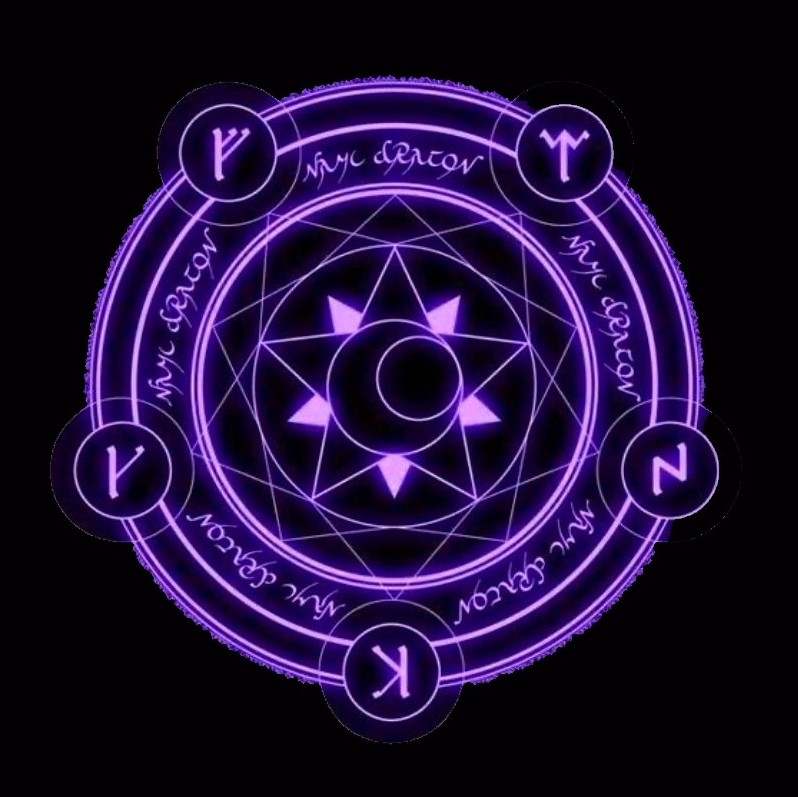

# Trabajo de implementacion de un aula virtual - Diseño de Interfaces

## Escuela Paquito
### Desarrolladoras
- Ivyel Gago Jiménez
- Ainhoa Conforme Alarcón

---
## Índice

### Estructura del proyecto

```txt
\---TrabajoAulaVirtual
    |   Proyecto Interfaces (1).pdf
    |
    +---estilos
    |       areaPersonal.css
    |       areaPersonal.css.map
    |       areaPersonal.scss
    |       asignaturaConcreta.css
    |       asignaturaConcreta.css.map
    |       asignaturaConcreta.scss
    |       footer.css
    |       footer.css.map
    |       footer.scss
    |       general.css
    |       general.css.map
    |       general.scss
    |       login.css
    |       misCursos.css
    |       misCursos.css.map
    |       misCursos.scss
    |
    +---html
    |       areaAsignatura.html
    |       areaPersonal.html
    |       asignaturaEspiritismo.html
    |       logIn.html
    |       misCursos.html
    |
    +---images
    |       adivinacion.jpg
    |       aitor_menta.jpg
    |       angulo-hacia-abajo.png
    |       astrologia.jpg
    |       astrologia2.jpg
    |       brujas.jpg
    |       cartas.jpg
    |       espiritismo.jpg
    |       espiritismo2.jpg
    |       espiritismo3.jpeg
    |       espiritismo4.webp
    |       facebookIcon.png
    |       fondo_bueno.gif
    |       fondo_login.jpeg
    |       historia_brujeria.webp
    |       instagramIcon.png
    |       LinkedInIcon.svg.png
    |       logo.png
    |       logo3.png
    |       logo4.jpg
    |       logo4_croped.jpg
    |       magia_negra_china.png
    |       quiromancia.jpg
    |       tarot1.jpg
    |       twitterIcon.png
    |
    +---media
    |       Insym gets terrified by the Summoning Circle.mp4
    |       Secunda.mp3
    |       Shadow wizard money gang (FULL FILM) (we love casting spells).mp3
    |
    \---scripts
            desplegarMenus.js
            music.js
```
### Descripción breve del aula virtual

